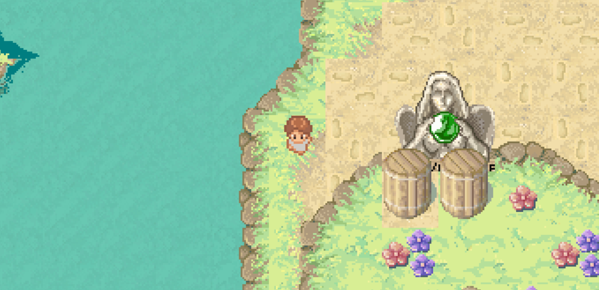

# Pixlemon

Pixlemon is an unfinished game project inspired by the world of Pokémon. It aims to recreate the experience of exploring a pixelated, top-down map filled with creatures to discover and interact with. Please note that the game is still a work in progress due to the complexity of the mechanics involved in its development.

## Installation Instructions

To start playing Pixlemon, simply visit this website here [Pixlemon]( https://pages.git.generalassemb.ly/kemen0/Project-One/) . There is no additional installation required, as the game is accessible directly through your web browser.

## Usage Instructions

Once you've accessed the Pixlemon website, you can control your character using the following keyboard commands:

- **W**: Move up
- **A**: Move left
- **S**: Move down
- **D**: Move right

Use these commands to navigate the map and explore the game world.

## Features

Pixlemon currently offers the following features:

- Top-down pixelated map for exploration.
- Character movement using the WASD keys.
- Basic interaction with the game environment.
- Basic boundry system.

## Contributing

I welcome contributions to the Pixlemon project. If you'd like to contribute, please follow these steps:

1. Fork the repository.
2. Create a new branch for your feature or bug fix.
3. Make your modifications or additions.
4. Commit your changes.
5. Push your changes to your forked repository.
6. Submit a pull request detailing your changes.

## Additional Details
Throughout the development of Pixlemon, I embarked on a journey of exploration and learning. It was my first time working with JSON, and despite the initial challenges, I was determined to utilize it for handling map collisions. I must admit, it was quite a learning curve for me, but I persevered and managed to successfully incorporate JSON for the collision functionality.

I dedicated a significant amount of time to Pixlemon, constantly experimenting with new concepts and techniques. The project took longer than expected because I wanted to make sure I tried out different approaches and explored innovative ideas. This experimental mindset added to the development timeline, but it also allowed me to gain valuable experience and expand my skills.

While I made progress with the collision system, implementing battle zones using a similar approach proved to be more challenging than anticipated. I encountered unexpected obstacles along the way, which required me to reassess my strategy and explore alternative solutions.

Another new concept I delved into was working with the canvas, which provided the foundation for the game's visual presentation. I faced alot of sitbacks, particularly related to handling collisions and implementing smooth movement using the WASD keys. However, with patience and perseverance, I managed to make significant headway and achieve satisfactory results.

Given the extensive experimentation and the time-consuming nature of the project, I couldn't accomplish everything I had initially planned within the desired timeframe. However, I want to assure you that Pixlemon is a labor of love, and I am committed to continue its development. There are still outstanding tasks and features on my roadmap, and I will do my best to incorporate them in future updates.

I sincerely appreciate your understanding and support and thank you.

